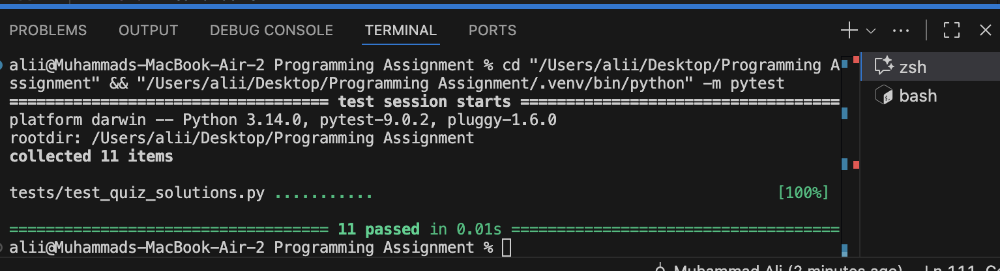

# Coding Quiz Solutions

The repository contains solutions of the attached coding quiz.

## Included functions

All implementations live in `src/quiz_solutions.py` and expose pure functions that take
inputs as parameters and immediately return the computed result.

| Question | Function | Core Technique |
| --- | --- | --- |
| 1. Majority Element | `majority_element(nums)` | Boyer–Moore majority vote (O(n) / O(1)) |
| 2. Valid Palindrome | `is_palindrome_phrase(s)` | Two-pointer scan, on the fly sanitization |
| 3. Climbing Stairs | `climb_stairs(n)` | Iterative Fibonacci DP with constant space |
| 4. Roman to Integer | `roman_to_int(s)` | Greedy parsing with subtraction handling |
| 5. Maximum Subarray | `max_subarray_sum(nums)` | Kadane's algorithm (O(n) / O(1)) |

## Setup & tests

Install dependencies (only `pytest` is required for the unit tests):

```bash
pip install -r requirements.txt
```

Run the full unit test suite:

```bash
pytest
```

## Example usage

```python
from src.quiz_solutions import (
    climb_stairs,
    is_palindrome_phrase,
    majority_element,
    max_subarray_sum,
    roman_to_int,
)

assert majority_element([2, 2, 1, 1, 1, 2, 2]) == 2
assert is_palindrome_phrase("A man, a plan, a canal: Panama") is True
assert climb_stairs(5) == 8
assert roman_to_int("MCMXCIV") == 1994
assert max_subarray_sum([-2, 1, -3, 4, -1, 2, 1, -5, 4]) == 6
```

## Test Cases And Result
